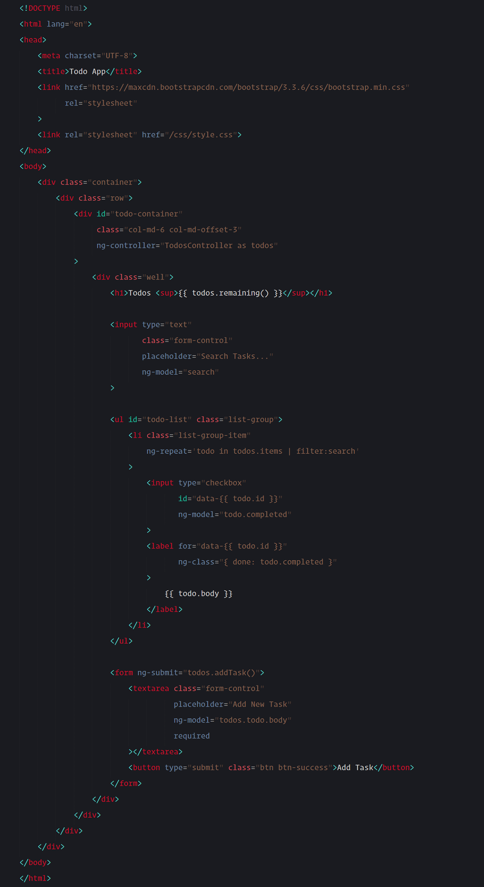
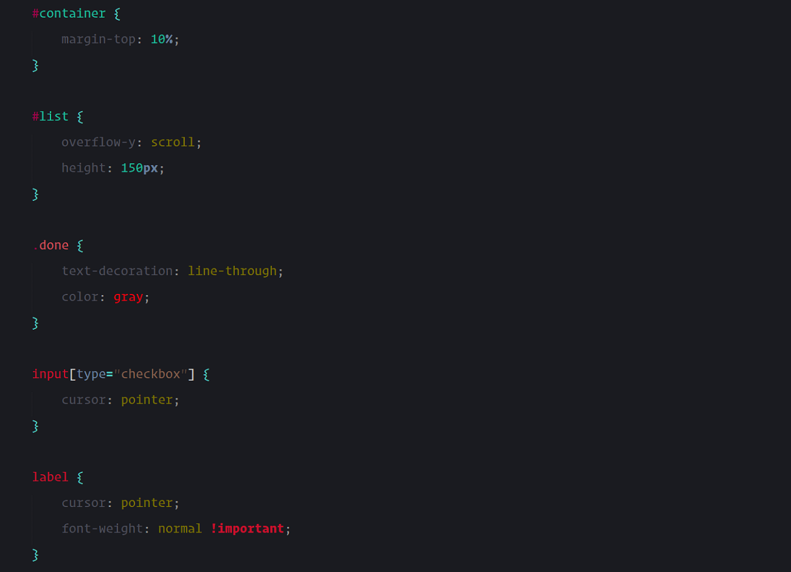
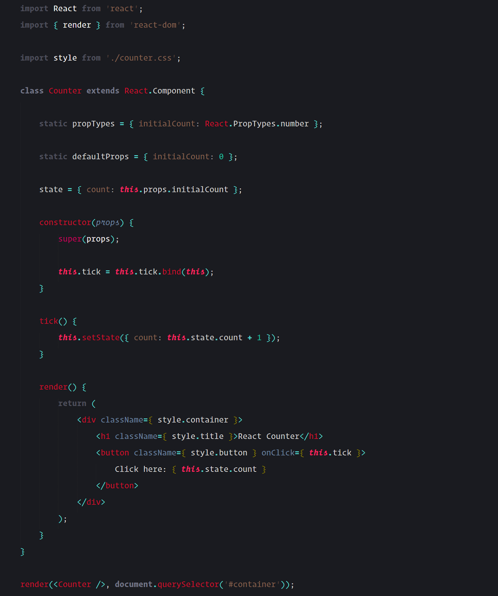
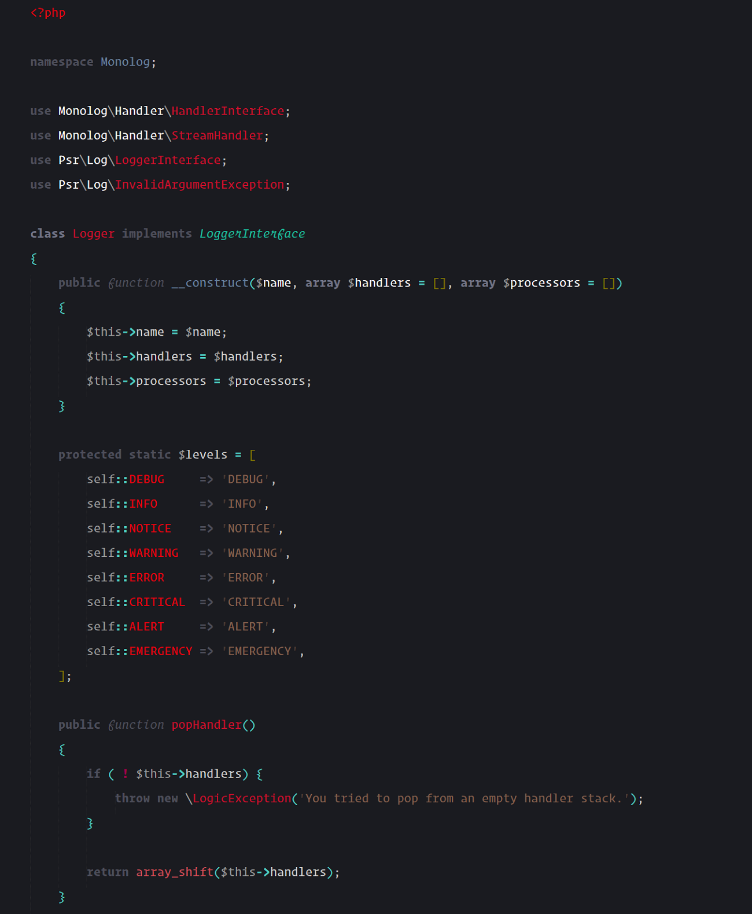
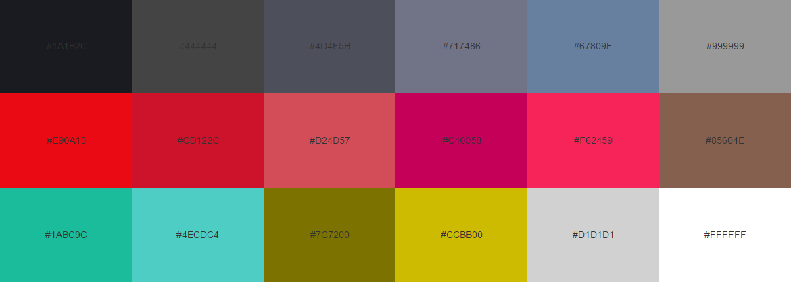

# Acme Color Scheme

A dark color scheme by <a href="https://twitter.com/zaynali53" target="_blank">@zaynali53</a>

## Previews

#### HTML Preview

#### CSS Preview

#### JS Preview

#### PHP Preview

The font used for the code is "<a href="http://www.typography.com/blog/introducing-operator" target="_blank">Operator Mono</a>"

## Color Palette

There is a list of colors used in Acme. Check it before porting the color scheme to another environments.

## Contributing

If you'd like to add some styles please do it inside `.YAML-tmLanguage` file. Then `.tmTheme` xml can be generated with such tool as (<a href="https://github.com/SublimeText/AAAPackageDev" target="_blank">AAAPackageDev</a>) for Sublime Text.

## License

The MIT License (MIT)

Copyright (c) 2016 Zayn Ali (<a href="https://twitter.com/zaynali53" target="_blank">@zaynali53</a>)

Permission is hereby granted, free of charge, to any person obtaining a copy of this software and associated documentation files (the "Software"), to deal in the Software without restriction, including without limitation the rights to use, copy, modify, merge, publish, distribute, sublicense, and/or sell copies of the Software, and to permit persons to whom the Software is furnished to do so, subject to the following conditions:

The above copyright notice and this permission notice shall be included in all copies or substantial portions of the Software.

THE SOFTWARE IS PROVIDED "AS IS", WITHOUT WARRANTY OF ANY KIND, EXPRESS OR IMPLIED, INCLUDING BUT NOT LIMITED TO THE WARRANTIES OF MERCHANTABILITY, FITNESS FOR A PARTICULAR PURPOSE AND NONINFRINGEMENT. IN NO EVENT SHALL THE AUTHORS OR COPYRIGHT HOLDERS BE LIABLE FOR ANY CLAIM, DAMAGES OR OTHER LIABILITY, WHETHER IN AN ACTION OF CONTRACT, TORT OR OTHERWISE, ARISING FROM, OUT OF OR IN CONNECTION WITH THE SOFTWARE OR THE USE OR OTHER DEALINGS IN THE SOFTWARE.